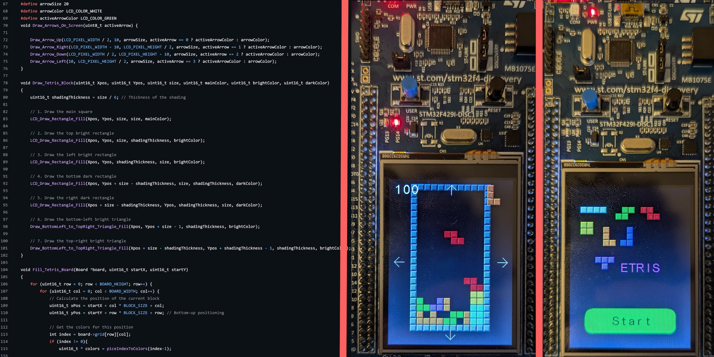

# stm32-discovery-tetris
This project is a full Tetris implementation, with the exception of the scoring which only scores row clears (multiple rows do include the proper score ammount) and not any of the other [official Tetris scoring methods](https://tetris.wiki/Scoring). It uses fully touch screen based input with the exception of full drops which use the button. There are additional configuration compile switches which make it more closely match the grading criteria including making the button rotate the piece instead of drop it and change the timing of the automatic drops.

There is currently a bug where if you release the touch before drawing completes it will not continue rendering untill you press and release again. This will be fixed soon.

The project should be good to go if you just compile and upload it directly to the STM 32 discovery one (DISC-1) board using the STMCUBE IDE.

If you want to see the code check [this folder](PHindesFinal/Core).

